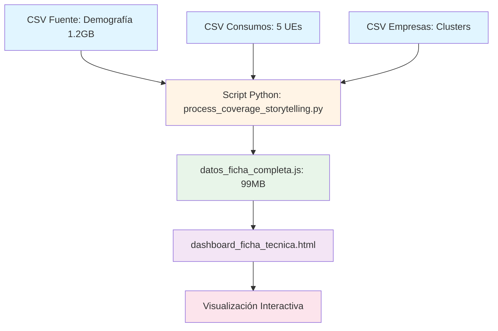

# 📘 Documentación Técnica: Dashboard de Ficha Técnica Empresarial

## 📋 Índice

1. [Resumen Ejecutivo](#resumen-ejecutivo)
2. [Arquitectura del Sistema](#arquitectura-del-sistema)
3. [Flujo de Datos (ETL)](#flujo-de-datos-etl)
4. [Scripts de Python](#scripts-de-python)
5. [Estructura de Datos](#estructura-de-datos)
6. [Frontend (HTML/JavaScript)](#frontend-htmljavascript)
7. [Cruces de Datos](#cruces-de-datos)
8. [Requisitos y Dependencias](#requisitos-y-dependencias)
9. [Guía de Ejecución](#guía-de-ejecución)

---

## 🎯 Resumen Ejecutivo

El **Dashboard de Ficha Técnica Empresarial** es una aplicación web interactiva que permite analizar el perfil demográfico, segmentación poblacional y cobertura de consumos de empresas afiliadas a Colsubsidio. 

**Características principales:**
- Análisis de **~3,500 empresas** con datos de **~1.6 millones de afiliados**
- Comparación con **benchmarks** (Grandes, Foco, Cluster)
- Visualización de coberturas 2024-2025 en **5 Unidades de Negocio** (Vivienda, Hoteles, Piscilago, R&D, Medicamentos)
- Indicadores avanzados: **Índice de Salud Sistémico**, **Coeficiente de Concentración**
- Gráfico radar competitivo para comparación visual

---

## 🏗️ Arquitectura del Sistema



### Componentes del Sistema

| Componente | Tipo | Tamaño | Descripción |
|------------|------|--------|-------------|
| **Archivos CSV Fuente** | Datos | 1.2GB+ | Datos demográficos y consumos |
| **Scripts Python** | Procesamiento | ~15KB | ETL y transformación de datos |
| **datos_ficha_completa.js** | Datos procesados | 99MB | JSON con empresas y benchmarks |
| **dashboard_ficha_tecnica.html** | Frontend | 52KB | Interfaz web interactiva |

---

## 🔄 Flujo de Datos (ETL)

### Fase 1: Extracción (Extract)

#### Archivos de Entrada

1. **COLSUBSIDIO_LT_CV_IDN_CONSOLIDACION_FINAL_SEGM.csv** (1.2GB)
   - **Ubicación:** `C:\Users\crisrojagu\Documents\Cruces_col\Cruces_col\data\`
   - **Contenido:** Datos demográficos completos de afiliados
   - **Columnas clave:**
     - `ID_PERSONA`: Identificador único del afiliado
     - `NOMBRE_EMPRESA_PRINCIPAL`: Razón social de la empresa
     - `NIT`: Número de identificación tributaria
     - `SEGMENTO_POBLACIONAL`: Segmento (Básico, Medio, Joven, Alto, etc.)
     - `PIRAMIDE_NUEVA`: Clasificación por tamaño (1 Grandes, 2 Medianas, etc.)
     - `EMPRESA_FOCO`: Marca "X" si es empresa foco
     - `RANGO_EDAD`, `RANGO_SALARIAL`, `CATEGORIA`, `GENERO`

2. **COLSUBSIDIO_LT_CV_IDN_LIST_EMPRESAS_SEGM.csv**
   - **Ubicación:** `C:\Users\crisrojagu\Documents\Cruces_col\Cruces_col\data\`
   - **Contenido:** Mapa de clusters empresariales
   - **Columnas clave:**
     - `ID_EMP_FILIAL`: ID de la empresa
     - `CLUSTER_EMPRESARIAL_GRUPO`: Cluster (PÚBLICO, CONSTRUCCIÓN, TRANSPORTE, etc.)

3. **Archivos de Consumos** (5 archivos CSV)
   - **Ubicación:** `C:\Users\crisrojagu\Documents\Consumos\data\`
   - **Archivos:**
     - `VIVIENDA.csv`
     - `HOTELES.csv`
     - `PISCILAGO.csv`
     - `RYD.csv` (Recreación y Deporte)
     - `MEDICAMENTOS.csv`
   - **Columnas clave:**
     - `FECHA`: Fecha del consumo (formato YYYY-MM-DD)
     - `ID_PERSONA` o `NUMERO_IDENTIFICACION_AFILIADO`: ID del consumidor

### Fase 2: Transformación (Transform)

#### Paso 1: Mapeo de Consumidores

```python
# Estructura: { ID_PERSONA: { UE: set(Years) } }
consumidores = {
    "CC12345678": {
        "VIVIENDA": {"2024", "2025"},
        "HOTELES": {"2025"}
    }
}
```

**Proceso:**
1. Leer cada archivo de consumos (VIVIENDA, HOTELES, etc.)
2. Normalizar IDs (agregar prefijo "CC" si no existe)
3. Extraer año de la fecha
4. Filtrar solo años 2024 y 2025
5. Crear un set de años por UE para cada persona

#### Paso 2: Procesamiento Demográfico

**Agregación por empresa:**

```python
empresas[nombre_empresa] = {
    "NIT": "...",
    "Piramide": "1 Grandes",
    "Foco": "X",
    "Cluster": "PÚBLICO",
    "Total": 1500,  # Total afiliados
    "Segmentos": {
        "Básico": 300,
        "Medio": 600,
        "Joven": 400,
        "Alto": 200
    },
    "Edades": {...},
    "Salarios": {...},
    "Categorias": {...},
    "Consumos": {
        "VIVIENDA": {
            "2024_Básico": 50,
            "2024_Medio": 120,
            "2025_Básico": 60,
            "2025_Medio": 150
        }
    }
}
```

**Cruce de Consumos:**
- Para cada afiliado en demografía:
  - Buscar su ID en el mapa de consumidores
  - Si consumió en alguna UE:
    - Incrementar contador `Consumos[UE][Year_Segmento]`

#### Paso 3: Cálculo de Benchmarks

**Tipos de Benchmarks:**

1. **SISTEMA_TOTAL**: Todos los afiliados del sistema
2. **BENCHMARK_GRANDES**: Solo empresas con `Piramide = "1 Grandes"`
3. **BENCHMARK_FOCO**: Solo empresas con `Foco = "X"`
4. **BENCHMARK_CLUSTER_{nombre}**: Empresas del mismo cluster (solo Grandes y Medianas)

**Estructura idéntica a empresas:**

```python
benchmarks["BENCHMARK_GRANDES"] = {
    "Total": 500000,
    "Segmentos": {...},
    "Consumos": {...}
}
```

### Fase 3: Carga (Load)

**Archivo de salida:** `datos_ficha_completa.js`

```javascript
const datosFichaCompleta = {
    "Empresas": {
        "NOMBRE_EMPRESA_1": {...},
        "NOMBRE_EMPRESA_2": {...}
    },
    "Benchmarks": {
        "SISTEMA_TOTAL": {...},
        "BENCHMARK_GRANDES": {...},
        "BENCHMARK_FOCO": {...},
        "BENCHMARK_CLUSTER_PÚBLICO": {...}
    }
};
```

---

## 🐍 Scripts de Python

### 1. `process_coverage_storytelling.py`

**Propósito:** Script principal que genera `datos_ficha_completa.js`

**Ubicación:** `C:\Users\crisrojagu\Documents\Proy_65\Proy_65\Scripts\Procesamiento\`

**Dependencias:**
```python
import csv
import json
import os
from collections import defaultdict
```

**Funciones principales:**

#### `clean_encoding(text)`
- **Propósito:** Corrige artefactos de codificación UTF-8 mal interpretados
- **Entrada:** String con caracteres mal codificados
- **Salida:** String corregido
- **Ejemplo:** `"PÚBLICO"` → `"PÚBLICO"`

#### `get_age_range(age_str)`
- **Propósito:** Convierte edad numérica a rango
- **Entrada:** String con edad (ej: "32")
- **Salida:** Rango (ej: "26-35")

#### `main()`
- **Propósito:** Función principal que ejecuta todo el flujo ETL
- **Pasos:**
  1. Cargar mapa de clusters empresariales
  2. Mapear consumidores únicos de los 5 archivos de UE
  3. Procesar archivo demográfico (1.2GB) línea por línea
  4. Cruzar consumos con demografía
  5. Calcular benchmarks
  6. Guardar resultado en formato JavaScript

**Tiempo de ejecución:** ~5-10 minutos (dependiendo del hardware)

**Uso de memoria:** ~2-3 GB RAM

### 2. `crear_ficha_empresarial.py`

**Propósito:** Script simplificado que solo procesa demografía (sin consumos)

**Salidas:**
- `empresas_grandes.json`
- `empresas_foco.json`
- `empresas_cluster.json`

> **Nota:** Este script es una versión legacy. El dashboard actual usa `process_coverage_storytelling.py`

---

## 📊 Estructura de Datos

### Objeto Empresa

```javascript
{
    "NIT": "8001234567",
    "Piramide": "1 Grandes",
    "Foco": "X",
    "Cluster": "PÚBLICO",
    "Total": 1500,
    "SegmentoPredominante": "Medio",
    "Segmentos": {
        "Empresarial": 100,
        "Facilitadores": 150,
        "Independientes": 200,
        "Madurez": 250,
        "Nuevas Generaciones": 300,
        "Protección Social": 100,
        "Básico": 150,
        "Medio": 150,
        "Joven": 50,
        "Alto": 50
    },
    "Edades": {
        "Menor de 20 años": 50,
        "20 a 35 años": 400,
        "36 a 45 años": 500,
        "46 a 55 años": 400,
        "Mayor de 55 años": 150
    },
    "Salarios": {
        "Hasta 2 SMLV": 200,
        "Entre 2 y 3 SMLV": 400,
        "Entre 3 y 4 SMLV": 500,
        "Entre 4 y 6 SMLV": 300,
        "Entre 6 y 8 SMLV": 100
    },
    "Categorias": {
        "A": 200,
        "B": 500,
        "C": 600,
        "D": 200
    },
    "Consumos": {
        "VIVIENDA": {
            "2024_Básico": 10,
            "2024_Medio": 25,
            "2024_Joven": 15,
            "2024_Alto": 5,
            "2025_Básico": 12,
            "2025_Medio": 30,
            "2025_Joven": 18,
            "2025_Alto": 7
        },
        "HOTELES": {...},
        "PISCILAGO": {...},
        "RYD": {...},
        "MEDICAMENTOS": {...}
    }
}
```

### Segmentos Poblacionales

| Segmento | Descripción |
|----------|-------------|
| **Empresarial** | Profesionales con perfil corporativo |
| **Facilitadores** | Trabajadores en roles de soporte |
| **Independientes** | Trabajadores autónomos |
| **Madurez** | Afiliados en etapa de consolidación |
| **Nuevas Generaciones** | Jóvenes profesionales |
| **Protección Social** | Afiliados con necesidades especiales |
| **Básico** | Nivel socioeconómico básico |
| **Medio** | Nivel socioeconómico medio |
| **Joven** | Jóvenes en inicio de carrera |
| **Alto** | Nivel socioeconómico alto |

---

## 💻 Frontend (HTML/JavaScript)

### Archivo Principal

**`dashboard_ficha_tecnica.html`**
- **Ubicación:** `C:\Users\crisrojagu\Documents\Proy_65\Proy_65\Dashboards\`
- **Tamaño:** 52KB
- **Tecnologías:**
  - HTML5
  - CSS3 (Vanilla, sin frameworks)
  - JavaScript (ES6+)
  - Chart.js (para gráfico radar)

### Estructura del Dashboard

```
┌─────────────────────────────────────────┐
│  HEADER: Ficha Técnica Empresarial      │
├─────────────────────────────────────────┤
│  🔍 Buscador de Empresas                │
├─────────────────────────────────────────┤
│  📊 Perfil de Empresa                   │
│  ├─ Nombre, NIT, Pirámide, Cluster      │
│  ├─ Badges (Foco, Cluster)              │
│  └─ ❓ Metodología (Modal)              │
├─────────────────────────────────────────┤
│  📈 Métricas Clave (Cards)              │
│  ├─ Total Afiliados                     │
│  ├─ Segmento Predominante               │
│  ├─ Categoría Predominante              │
│  ├─ Índice de Salud Sistémico           │
│  └─ Coeficiente de Concentración        │
├─────────────────────────────────────────┤
│  🏢 Resumen por UE (Mini Cards)         │
│  ├─ VIVIENDA                            │
│  ├─ HOTELES                             │
│  ├─ PISCILAGO                           │
│  └─ RYD                                 │
├─────────────────────────────────────────┤
│  📊 Análisis por UE                     │
│  ├─ Tabs: Vivienda | Hoteles | ...     │
│  ├─ Toggle: Top 2 / Todos los segmentos│
│  ├─ Grid de Segmentos (Cards)          │
│  └─ 🕸️ Radar Competitivo               │
└─────────────────────────────────────────┘
```

### Funciones JavaScript Clave

#### `selectCompany(companyName)`
- **Propósito:** Carga y muestra los datos de una empresa
- **Acciones:**
  - Actualiza perfil de empresa
  - Renderiza métricas clave
  - Calcula indicadores avanzados
  - Muestra resumen de UEs
  - Renderiza análisis por segmento

#### `renderAnalysis()`
- **Propósito:** Renderiza el análisis de cobertura por UE
- **Acciones:**
  - Filtra segmentos (Top 2 o todos)
  - Calcula coberturas 2024-2025
  - Calcula variaciones
  - Compara con benchmarks
  - Renderiza gráfico radar

#### `renderComparisonChart()`
- **Propósito:** Crea el gráfico radar competitivo
- **Características:**
  - Escala dinámica (se ajusta a los valores reales)
  - 4 datasets: Empresa, Grandes, Foco, Cluster
  - Tooltips interactivos
  - Colores semi-transparentes

#### `calculateHealthIndex(company, benchmarks)`
- **Propósito:** Calcula el Índice de Salud Sistémico
- **Fórmula:**
  ```
  Health Index = Promedio Ponderado de Coberturas
  
  Donde:
  - Cobertura_Cluster: 50%
  - Cobertura_Foco: 30%
  - Cobertura_Grandes: 20%
  
  Cobertura = (Consumos 2025 / Total Afiliados) × 100
  ```

#### `calculateConcentrationCoefficient(company)`
- **Propósito:** Calcula el Coeficiente de Concentración
- **Fórmula:**
  ```
  Concentration = (Top 2 Segmentos / Total Afiliados) × 100
  ```

---

## 🔗 Cruces de Datos

### Cruce 1: Demografía ↔ Consumos

**Objetivo:** Determinar qué afiliados de cada empresa consumieron en cada UE

**Proceso:**

1. **Mapeo de Consumidores:**
   ```python
   # Leer VIVIENDA.csv
   consumidores["CC12345678"]["VIVIENDA"].add("2024")
   consumidores["CC12345678"]["VIVIENDA"].add("2025")
   ```

2. **Cruce con Demografía:**
   ```python
   # Al procesar cada fila de demografía
   persona_id = row[0]  # "CC12345678"
   empresa = row[51]    # "EMPRESA XYZ"
   segmento = row[12]   # "Medio"
   
   # Buscar si consumió
   if persona_id in consumidores:
       for ue, years in consumidores[persona_id].items():
           for year in years:
               key = f"{year}_{segmento}"  # "2024_Medio"
               empresas[empresa]["Consumos"][ue][key] += 1
   ```

3. **Resultado:**
   ```javascript
   "Consumos": {
       "VIVIENDA": {
           "2024_Medio": 120,  // 120 afiliados del segmento Medio consumieron en 2024
           "2025_Medio": 150   // 150 afiliados del segmento Medio consumieron en 2025
       }
   }
   ```

### Cruce 2: Empresa ↔ Cluster

**Objetivo:** Asignar cluster empresarial a cada empresa

**Proceso:**

1. **Cargar Mapa de Clusters:**
   ```python
   cluster_map = {
       "12345": "PÚBLICO",
       "67890": "CONSTRUCCIÓN"
   }
   ```

2. **Asignar al Procesar Demografía:**
   ```python
   id_empresa = row[25]  # "12345"
   cluster = cluster_map.get(id_empresa, "General")
   empresas[nombre]["Cluster"] = cluster
   ```

### Cruce 3: Empresa ↔ Benchmarks

**Objetivo:** Comparar cada empresa con grupos de referencia

**Proceso:**

1. **Determinar Grupos de Benchmark:**
   ```python
   groups = ["SISTEMA_TOTAL"]
   
   if piramide == "1 Grandes":
       groups.append("BENCHMARK_GRANDES")
   
   if foco == "X":
       groups.append("BENCHMARK_FOCO")
   
   if cluster and piramide in ["1 Grandes", "2 Medianas"]:
       groups.append(f"BENCHMARK_CLUSTER_{cluster}")
   ```

2. **Agregar a Benchmarks:**
   ```python
   for group in groups:
       benchmarks[group]["Total"] += 1
       benchmarks[group]["Segmentos"][segmento] += 1
       # ... etc
   ```

3. **Uso en Frontend:**
   ```javascript
   // Calcular cobertura de benchmark
   const benchTotal = benchmarks["BENCHMARK_GRANDES"]["Segmentos"]["Medio"];
   const benchCons = benchmarks["BENCHMARK_GRANDES"]["Consumos"]["VIVIENDA"]["2025_Medio"];
   const benchCoverage = (benchCons / benchTotal) * 100;
   ```

---

## 📦 Requisitos y Dependencias

### Python

**Versión:** Python 3.7+

**Librerías estándar:**
- `csv`: Lectura de archivos CSV
- `json`: Serialización de datos
- `os`: Manejo de rutas
- `collections.defaultdict`: Estructuras de datos

**No requiere instalación de paquetes externos** ✅

### Frontend

**Navegador:** Cualquier navegador moderno (Chrome, Firefox, Edge, Safari)

**Librerías externas:**
- **Chart.js** (CDN): `https://cdn.jsdelivr.net/npm/chart.js`
- **Google Fonts - Outfit**: `https://fonts.googleapis.com/css2?family=Outfit`

### Archivos de Datos Requeridos

| Archivo | Tamaño | Ubicación |
|---------|--------|-----------|
| COLSUBSIDIO_LT_CV_IDN_CONSOLIDACION_FINAL_SEGM.csv | 1.2GB | `C:\Users\crisrojagu\Documents\Cruces_col\Cruces_col\data\` |
| COLSUBSIDIO_LT_CV_IDN_LIST_EMPRESAS_SEGM.csv | ~30MB | `C:\Users\crisrojagu\Documents\Cruces_col\Cruces_col\data\` |
| VIVIENDA.csv | Variable | `C:\Users\crisrojagu\Documents\Consumos\data\` |
| HOTELES.csv | Variable | `C:\Users\crisrojagu\Documents\Consumos\data\` |
| PISCILAGO.csv | Variable | `C:\Users\crisrojagu\Documents\Consumos\data\` |
| RYD.csv | Variable | `C:\Users\crisrojagu\Documents\Consumos\data\` |
| MEDICAMENTOS.csv | Variable | `C:\Users\crisrojagu\Documents\Consumos\data\` |

---

## 🚀 Guía de Ejecución

### Paso 1: Preparar Archivos de Datos

1. Verificar que todos los archivos CSV estén en las ubicaciones correctas
2. Asegurar que los archivos tengan la codificación correcta (UTF-8 o Latin-1)

### Paso 2: Ejecutar Script de Procesamiento

```bash
cd C:\Users\crisrojagu\Documents\Proy_65\Proy_65\Scripts\Procesamiento

python process_coverage_storytelling.py
```

**Salida esperada:**
```
================================================================================
PROCESAMIENTO DE COBERTURA Y STORYTELLING
================================================================================

Cargando mapa de clusters empresariales...
  ✓ Leído con utf-8-sig
  ✓ Cargados 3,456 clusters empresariales

Leyendo consumos de VIVIENDA...
Leyendo consumos de HOTELES...
Leyendo consumos de PISCILAGO...
Leyendo consumos de RYD...
Leyendo consumos de MEDICAMENTOS...
1,234,567 consumidores únicos mapeados.

Leyendo demografía: C:\Users\...\COLSUBSIDIO_LT_CV_IDN_CONSOLIDACION_FINAL_SEGM.csv
  Usando encoding: utf-8-sig
  Procesados 500,000 registros...
  Procesados 1,000,000 registros...
  Procesados 1,500,000 registros...

Guardando resultados...
Proceso completado. Datos guardados en C:\Users\...\datos_ficha_completa.js
```

**Tiempo estimado:** 5-10 minutos

### Paso 3: Abrir Dashboard

1. Navegar a: `C:\Users\crisrojagu\Documents\Proy_65\Proy_65\Dashboards\`
2. Abrir `dashboard_ficha_tecnica.html` en un navegador
3. Esperar a que cargue el archivo de datos (99MB)
4. Buscar y seleccionar una empresa

### Paso 4: Uso del Dashboard

1. **Buscar Empresa:**
   - Escribir nombre en el buscador
   - Seleccionar de la lista desplegable

2. **Analizar Métricas:**
   - Ver métricas clave en las tarjetas superiores
   - Revisar resumen de UEs

3. **Explorar por UE:**
   - Cambiar entre tabs (Vivienda, Hoteles, etc.)
   - Usar toggle para filtrar Top 2 segmentos
   - Analizar gráfico radar

4. **Ver Metodología:**
   - Clic en botón "❓ Metodología"
   - Revisar fórmulas de indicadores

---

## 🔧 Solución de Problemas

### Error: "No se encontraron los datos"

**Causa:** El archivo `datos_ficha_completa.js` no existe o está en ubicación incorrecta

**Solución:**
1. Verificar que el archivo existe en `C:\Users\crisrojagu\Documents\Proy_65\Proy_65\Datos\`
2. Ejecutar `process_coverage_storytelling.py` nuevamente

### Error: "UnicodeDecodeError"

**Causa:** Problemas de codificación en archivos CSV

**Solución:**
- El script intenta automáticamente UTF-8 y Latin-1
- Si persiste, abrir el CSV en Excel y guardar como "CSV UTF-8"

### Dashboard muy lento al cargar

**Causa:** Archivo de datos de 99MB

**Solución:**
- Esperar ~10-30 segundos en la primera carga
- El navegador cachea el archivo después
- Considerar usar un servidor local (no abrir directamente desde archivo)

---

## 📈 Métricas del Sistema

| Métrica | Valor |
|---------|-------|
| **Total Empresas** | ~3,500 |
| **Total Afiliados** | ~1.6 millones |
| **Archivos CSV Procesados** | 7 |
| **Tamaño Total Datos Fuente** | ~1.5 GB |
| **Tamaño Datos Procesados** | 99 MB |
| **Tiempo Procesamiento** | 5-10 min |
| **Benchmarks Calculados** | 15+ (Sistema, Grandes, Foco, Clusters) |
| **Segmentos Poblacionales** | 10 |
| **Unidades de Negocio** | 5 |

---

## 📝 Notas Finales

- **Actualización de Datos:** Ejecutar `process_coverage_storytelling.py` cada vez que se actualicen los archivos CSV fuente
- **Rendimiento:** El script está optimizado para procesar archivos grandes línea por línea (bajo uso de memoria)
- **Escalabilidad:** El sistema puede manejar más UEs agregando archivos CSV y actualizando la lista `UES` en el script
- **Mantenimiento:** Los indicadores (Health Index, Concentration) pueden ajustarse modificando las funciones JavaScript correspondientes

---

**Versión:** 1.0  
**Última Actualización:** 2026-02-10  
**Autor:** Sistema de Análisis Empresarial - Colsubsidio
